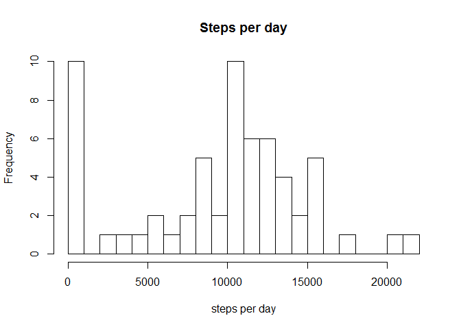
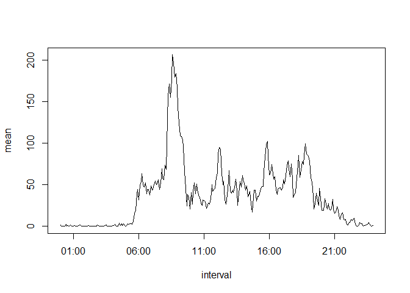
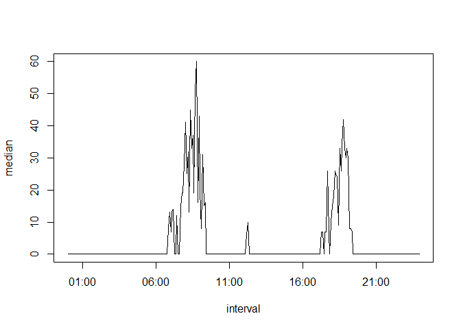
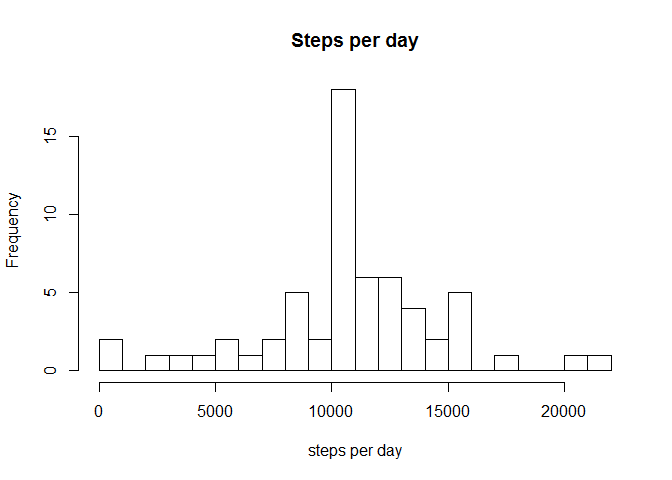
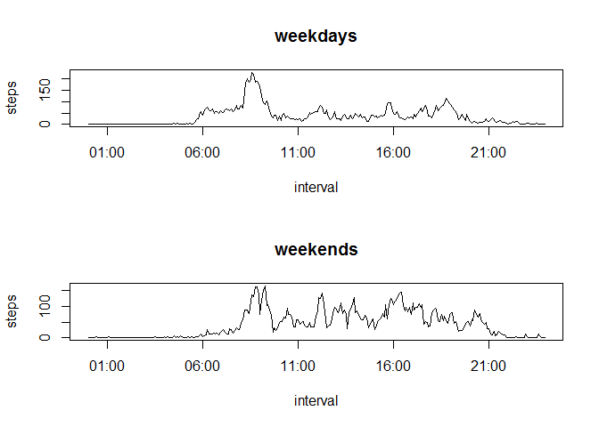
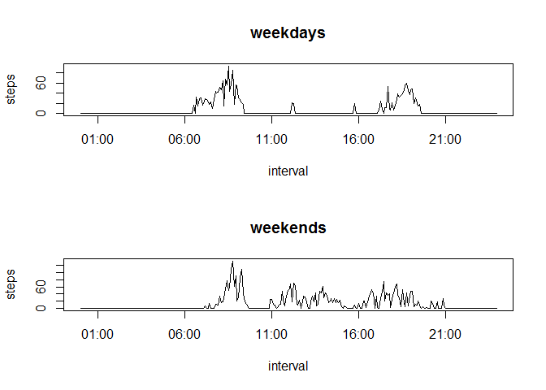

# Reproducible Research: Peer Assessment 1


## Loading and preprocessing the data
The data is read into a dataframe named "data" and the intervals are turned into 4 characters ("5" turns into "0005").


```r
######  Read and tidy the data ##############
data <- read.csv("C:/Users/Michael/RepResearch/RepData_PeerAssessment1/activity.csv", stringsAsFactors = FALSE)
data$interval <- sprintf("%04d", data$interval)
```


## What is mean total number of steps taken per day?

The number of steps per day is calculated by finding unique dates in the raw data and  creating a loop that goes through each day adds up the number of steps. The sum function is set to ignore the NA vlues by default, however there are several days where the Fitbit may not have been turned on and there is no data at all. The sum function would return NA in this case and the total steps for those days are set to zero. I debated dropping these out of the histogram but decided since several other days have large numbers of NA's that I would leave any changes for the later parts of the project.


```r
######  Compute steps per day 
day <- unique(data$date)    # the dates that occur
databyday <- data.frame()  # Creates new dataframe with just dates and steps per day
for(i in 1:length(day))
      {
      dataday <- subset(data, data$date == day[i])
      databyday[i, 1] <- day[i]
        if(is.na(sum(dataday[, 1])) == "TRUE")  # sets steps to zero if no data from that day
        {databyday[i,2] <- 0}
        else{databyday[i,2] <-sum(dataday[, 1])
        }
      }
names(databyday) <- c("date", "steps") 
mean <- mean(databyday$steps, na.rm = TRUE)      ## computes median and mean
median <- median(databyday$steps, na.rm = TRUE)
```

Here is a histogram of the data.


```r
###### Histogram ####################
hist(databyday$steps, breaks = 20, xlab = "steps per day", main = "Steps per day")
```

 

The mean number of steps per day is 9354.23. 

The median number of steps per day is 10395.00.

## What is the average daily activity pattern?

To see how the person's activity varies during the day, I created a dataframe with 
a row for each interval, containing the mean and median for that interval across all the days, since I view each as an average. There are some interesting differences between the two as the median is zero quite often, but the mean is not. I included both time series.   


```r
################   Activity pattern   #################
##### Find averages for each interval
int <- unique(data$interval)
databyint <- data.frame()
for (i in 1:length(int))
        {dataint <- subset(data, data$interval == int[i])
        databyint[i,1] <- int[i]
        databyint[i,2] <- mean(dataint[,1], na.rm = TRUE)
        databyint[i,3] <- median(dataint[,1], na.rm = TRUE)
        databyint[i,4] <- i}
names(databyint) <- c("interval","mean","median", "number")
databyint$number <- strptime(databyint$interval, format = "%H%M")
maxmeaninterval <- databyint[which.max(databyint$mean),1]
maxmedinterval <- databyint[which.max(databyint$median),1]
```

Here is a plot of the mean steps in a 5 minute interval by interval, or time of day.


```r
with(databyint, 
         {plot(number, mean, type= "l", xlab = "interval" )}
    )
```

 

The interval with the maximum mean number of steps is 0835, which is seen as the x-value of the peak on the plot.

Here is a plot of the median steps in a 5 minute interval by interval, or time of day.


```r
with(databyint, 
          {plot(number, median, type= "l", xlab = "interval" )}
    )
```

 

The interval with the maximum median number of steps is 0845, which is also the x-value of the peak on the plot. 

However, it is very interesting to see these are not the same and that the median is almost always lower by quite a bit. To jump ahead the graph of the median matches more closely with weekday activity.

## Imputing missing values


```r
numberNA <- length(complete.cases(data$steps)[complete.cases(data$steps) == FALSE])
```
Since the data is has many NA values it would be nice to replace them.

There are 2304 NA's occuring in the data.


```r
imputed <- data        
for(k in 1:nrow(data))
  {
  if(is.na(data[k, 1]) == TRUE)    # find NA values
    {j <- data[k,3]
     imputed[k, 1] <- databyint[databyint$interval ==  j,2]           
    }                 
  }     
imputedbyday <- data.frame() 
for(i in 1:length(day))
{
  imputedday <- subset(imputed, imputed$date == day[i]) # count steps per day
  imputedbyday[i, 1] <- day[i]
  imputedbyday[i,2] <-sum(imputedday[, 1])
}
names(imputedbyday) <- c("date", "steps") 
imputedmean <- mean(imputedbyday$steps, na.rm = TRUE)
imputedmedian <- median(imputedbyday$steps, na.rm = TRUE)
```

Once the values have been replaced, the histogram of steps per day now looks like this


```r
par(mfcol = c(1, 1))
hist(imputedbyday$steps, breaks = 20, xlab = "steps per day", main = "Steps per day")
```

 

The mean steps per day is 10766.19 compared with the original vaue of 9354.23.

The median steps per day is 10766.19 compared with the original vaue of 10395.00.

Both values have now changed to the value obtained by replacing all the data in a day.


## Are there differences in activity patterns between weekdays and weekends?

As one might expect for a working person, the daily activity is highly dependent on
whether or not that day is a weekday or not. 


```r
############## Code block 5: Weekday/weekend patterns
imputed$date <- as.Date(imputed$date)
#### define a factor variable based on whether the date is a weekday or not 
weekend <- c('Saturday','Sunday')
imputed$weekend <- factor((weekdays(imputed$date) %in% weekend)+1L, 
                          levels = 1:2 ,
                          labels = c('weekday','weekend'))
impint <- unique(imputed$interval)    ## duplicate the proceedure in the activity
wdimputedbyint <- data.frame()        ## pattern from before for weekdays
for (i in 1:length(impint))
{wdimpint2 <- subset(imputed, imputed$interval == int[i])
 wdimpint <- subset(wdimpint2, weekend == "weekday")
 wdimputedbyint[i,1] <- int[i]
 wdimputedbyint[i,2] <- mean(wdimpint[,1], na.rm = TRUE)
 wdimputedbyint[i,3] <- median(wdimpint[,1], na.rm = TRUE)
 wdimputedbyint[i,4] <- i
}
names(wdimputedbyint) <- c("interval","mean","median", "number")
wdimputedbyint$number <- strptime(wdimputedbyint$interval, format = "%H%M")

impint <- unique(imputed$interval)
weimputedbyint <- data.frame()           ## and for weekends
for (i in 1:length(impint))
{weimpint2 <- subset(imputed, imputed$interval == int[i])
 weimpint <- subset(weimpint2, weekend == "weekend")
 weimputedbyint[i,1] <- int[i]
 weimputedbyint[i,2] <- mean(weimpint[,1], na.rm = TRUE)
 weimputedbyint[i,3] <- median(weimpint[,1], na.rm = TRUE)
 weimputedbyint[i,4] <- i
}
names(weimputedbyint) <- c("interval","mean","median", "number")
weimputedbyint$number <- strptime(weimputedbyint$interval, format = "%H%M")
```

Splitting the data into weekend days and weekdays, the activity pattern using the mean steps per interval looks like this.


```r
par(mfcol = c(2, 1))
plot(wdimputedbyint$number, 
     wdimputedbyint$mean, 
     type= "l", 
     xlab = "interval",
     main = "weekdays",
     ylab = "steps")
plot(weimputedbyint$number, 
     weimputedbyint$mean, 
     type= "l",
     main = "weekends",
     xlab = "interval",
     ylab = "steps")
```

 

Using the median steps per interval it looks like this.


```r
par(mfcol = c(2, 1))
plot(wdimputedbyint$number, 
     wdimputedbyint$median, 
     type= "l", 
     xlab = "interval",
     main = "weekdays",
     ylab = "steps")
plot(weimputedbyint$number, 
     weimputedbyint$median, 
     type= "l",
     main = "weekends",
     xlab = "interval",
     ylab = "steps")
```

 
